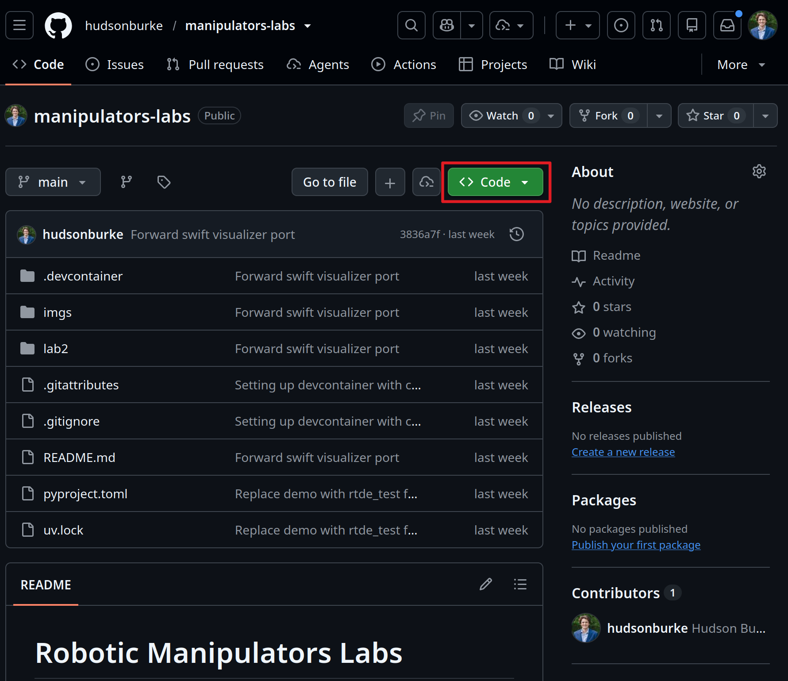
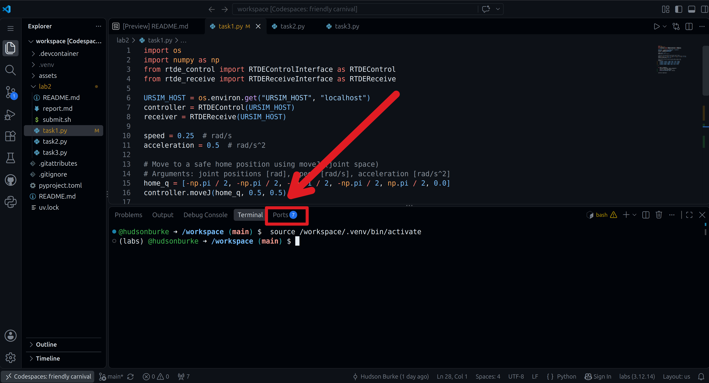
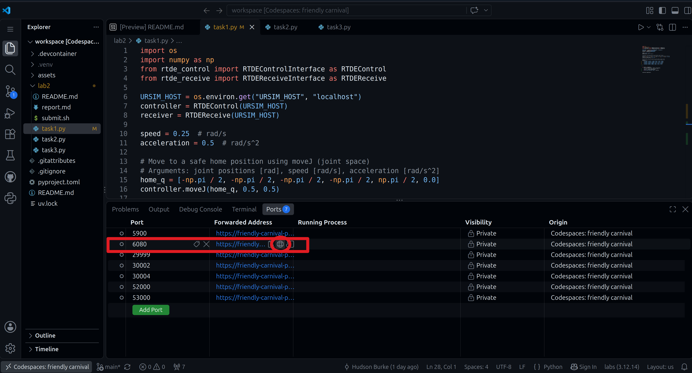
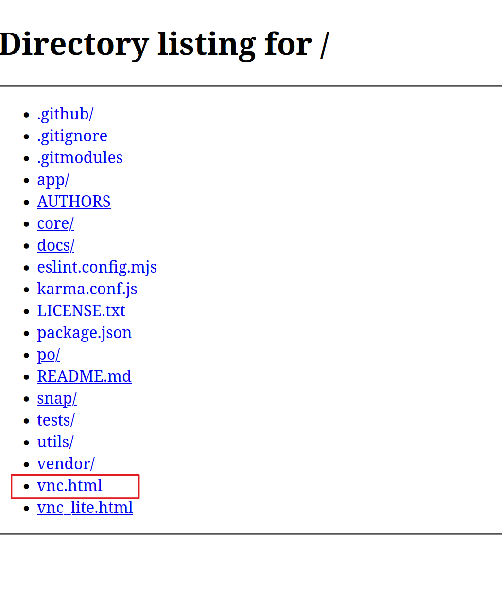
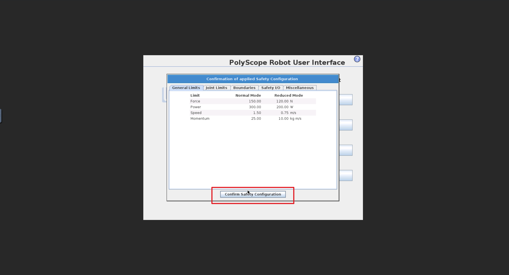
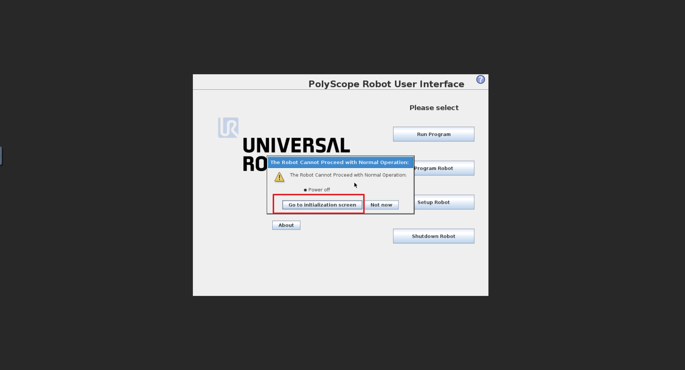
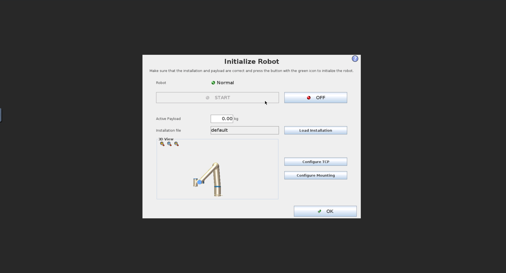
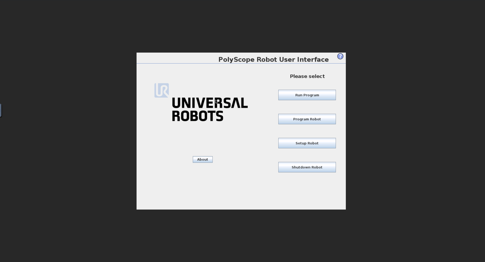
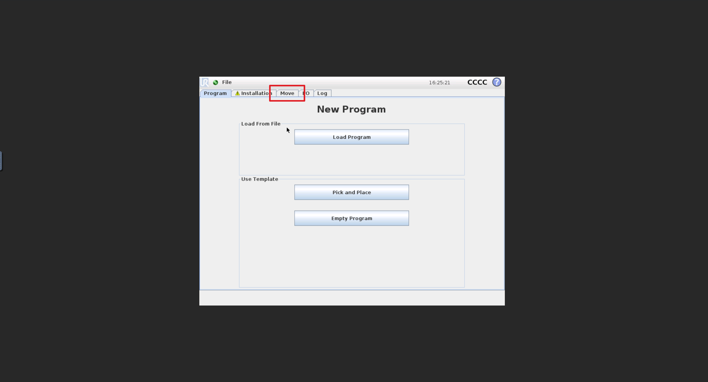

# Robotic Manipulators Labs

These labs aim to give you an opportunity to apply the concepts you learn in class to a real robot using tools that are at least partially used in industry.

You will be using a virtual UR5 robot, which is a 6-axis robotic arm made by Universal Robots.

## Environment Setup

You can use GitHub Codespaces or a [local setup](#Local-Setup) to run the code for these labs.
Codespaces also automatically starts URSim with Docker Compose.

### GitHub Codespaces

The easiest way to get started is to use GitHub Codespaces. 

Sign up for a GitHub account if you don't have one. You can sign up for it with your student email, and you'll get some free perks.

#### Creating a Codespace


Open the repository on GitHub, choose **Code → Codespaces → Create codespace on main**, and wait for the container build to finish.

#### Running URSim

To run a virtual UR5 robot, we are using the URSim Docker image. 
You don't need to worry about the details of this, but think of it like a lightweight virtual machine that runs the same software that runs on a real UR5 robot.
The Docker image is already set up in the Codespace, so you don't need to do anything else.
The Codespace automatically starts URSim with Docker Compose, so you don't need to do anything else.

Programs running inside the Codespace connect to URSim using the Compose
service name `ursim_cb3`. The workspace sets `URSIM_HOST` automatically. For a
local Python process, use `URSIM_HOST=localhost` because Docker publishes the
robot interfaces on the host.



To open the simulator, open the **Ports** panel and select the port labeled `6080`. 
Open `/vnc.html` on that forwarded URL.





This will open a browser tab with a VNC client connected to the URSim virtual robot.
Clicking `Connect` will open the interface






At this point, you can hit ok


Then press the `Program Robot` button and navigate to the Move tab


From here you should be able to manually move the robot arm around.

### Local Setup

#### WSL2

If you are on Windows, you'll need to use WSL2 (Windows Subsystem for Linux):
[WSL Install Instructions](https://learn.microsoft.com/en-us/windows/wsl/install)

#### git

You'll need git unless you just download the zip file of the repository, which I don't recommend purely on principle. 
The easiest way is to just use [GitHub Desktop](https://desktop.github.com/download/), but you can also use the command line by installing from <https://git-scm.com/install/>

If you use the command line interface (CLI), use this command to get a copy of the repository on your local machine:
```sh
git clone https://github.com/hudsonburke/manipulators-labs.git
```

#### `uv`

To manage Python dependencies, we are using `uv`, which is a tool that makes it easy to manage Python virtual environments and dependencies. You can install it by following the instructions here:

<https://docs.astral.sh/uv/getting-started/installation/>

After cloning the repository, you can install the dependencies by running the following command in the root of the repository:
```sh
uv sync
```

To run the code for Lab 2 Task 1, for example, in the virtual environment, you can use the following command:
```sh
uv run python lab2/task1.py
```

Lab 3 uses one Robotics Toolbox URDF UR5 model for kinematics, collision
checking with spatialgeometry, and Swift browser playback. Swift serves HTTP
on port `52000` and live updates on WebSocket port `53000`; forward both and
keep both private in Codespaces. The first URDF load may download and cache
robot-description assets; no MuJoCo or Menagerie assets are needed. Codespaces
(Linux) is recommended for the collision backend's Coal wheels. Full setup,
including secure WebSocket forwarding, and task instructions are in
[`lab3/README.md`](lab3/README.md). Lab 2 continues to use URSim as described
above.

#### Docker

To run a virtual UR5 robot, we are using the [URSim Docker image](https://hub.docker.com/r/universalrobots/ursim_cb3).
See this video for a quick overview of Docker:
<https://www.youtube.com/watch?v=Gjnup-PuquQ>

- Windows Install: <https://docs.docker.com/desktop/setup/install/windows-install/>
- Mac Install: <https://docs.docker.com/desktop/setup/install/mac-install/>
- Linux Install: If you are on Linux, I assume that you can figure this out for your distro

You will have to download the URSim Docker image by running:
```sh
docker pull universalrobots/ursim_cb3
```

To run URSim, you can use the following command:
```sh

# VNC port: 5900
# Web browser VNC port: 6080
docker run --rm -it -p 5900:5900 -p 6080:6080 universalrobots/ursim_cb3
```

Then you should be able to open it with <http://localhost:6080/vnc.html?host=localhost&port=6080>

