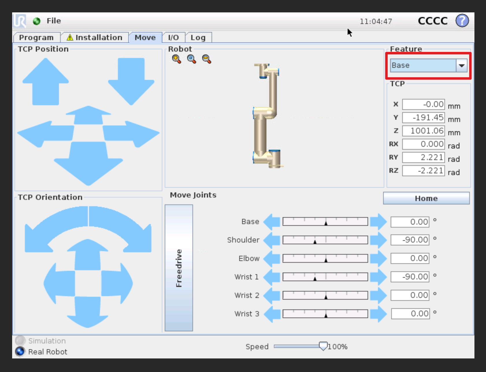

# Lab 2 — Forward and inverse kinematics with a UR5

## Purpose

In this lab, you will command a simulated UR5 robot through a short Cartesian trajectory, use a numerical inverse-kinematics (IK) solver to find joint configurations for the same poses, and command those configurations back to the robot. The objective is to become comfortable with URSim, `ur_rtde`, and Robotics Toolbox for Python while connecting the software workflow to the kinematics concepts from class.

By the end of the lab, you should be able to:

- distinguish a Cartesian tool pose from a six-joint robot configuration;
- use `moveL` to command a Cartesian path and `moveJ` to command a joint-space motion;
- describe forward kinematics as $T = f(q)$ and IK as finding a $q$ for a requested $T$;
- explain why an IK solution may depend on its initial guess and why matching endpoint poses does not imply matching paths.

## Tool references

- [`ur_rtde` quick start](https://sdurobotics.gitlab.io/ur_rtde/pages/getting_started/quick_start.html) — Python interface used to communicate with URSim.
- [Robotics Toolbox for Python](https://petercorke.github.io/robotics-toolbox-python/intro.html) — package that provides the UR5 model, forward kinematics, and numerical IK solver.

## Before you begin

1. Start URSim and open its web VNC interface, as described in the repository-level [README](../README.md).
2. Initialize the virtual robot, select **Program Robot**, and open the **Move** tab.
3. Run all supplied programs **only against URSim** for this lab. Do not run unreviewed lab code on a physical robot.
4. From the repository root, use `uv run python lab2/<script>.py`. If you are already in `lab2`, use `uv run python <script>.py` instead.

The scripts use the `URSIM_HOST` environment variable. The Codespace configures it automatically; a local setup normally uses `URSIM_HOST=localhost`.

## Background: poses, FK, and IK

The UR5 has six revolute joints. A **joint configuration** is

$$
q = [q_1, q_2, q_3, q_4, q_5, q_6]^T,
$$

where each entry is in radians. **Forward kinematics** maps that configuration to the pose of the tool frame relative to the base frame:

$$
T_{\mathrm{base}}^{\mathrm{tool}} = f(q).
$$

A pose contains a three-dimensional position and a three-dimensional orientation. **Inverse kinematics** works in the other direction: given a desired pose \(T_d\), it searches for one or more configurations such that \(f(q) \approx T_d\). This is not generally a one-to-one mapping. A UR5 can often reach the same tool pose with different elbow, shoulder, or wrist configurations. Some poses are unreachable or near a singularity, and numerical solvers can return different valid solutions when started from different initial guesses.

URSim and `ur_rtde` represent a TCP pose as

```text
[x, y, z, rx, ry, rz]
```

where position is in **meters** and `[rx, ry, rz]` is a **rotation vector** in radians (axis multiplied by rotation angle). It is **not** a roll-pitch-yaw triple. The supplied `pose_to_se3()` helper converts this UR representation into the rotation matrix used by Robotics Toolbox.

`moveL` takes Cartesian poses and interpolates a mostly straight TCP path. The controller performs its own IK while moving. `moveJ` takes joint angles and interpolates in joint space; its TCP path will generally be curved even if its start and end poses match a `moveL` command.

## Task 1 — Create and test a Cartesian trajectory

Create a small, reachable trajectory with **three to five waypoints**. A simple triangle, rectangle, or shallow arc in front of the robot works well. Keep adjacent points close together, remain well inside the visual workspace, and avoid configurations where the arm is fully stretched or folded tightly. Do not use the all-zero starter values as a robot pose.

1. In URSim's **Move** tab, set the **Feature** drop-down to **Base**. This makes the displayed pose relative to the robot base frame.

   

2. Jog the TCP to each waypoint and record the displayed `x`, `y`, `z`, `rx`, `ry`, and `rz` values. URSim displays position in millimeters; convert those three values to meters before entering them in Python. Copy the displayed rotation-vector values directly in radians.

   

3. Replace the placeholder rows in `goals.py` with your waypoints. Each row must have the form:

   ```python
   [x_m, y_m, z_m, rx_rad, ry_rad, rz_rad]
   ```

   The robot begins from the supplied home joint configuration before it moves through your points.

4. Run Task 1:

   ```sh
   uv run python lab2/task1.py
   ```

   Or, use the editor's play button:

   

5. Watch the motion in URSim. Confirm that the TCP visits each waypoint and that the `moveL` segments look Cartesian. If a point is not reachable or the motion is unexpected, stop and revise the waypoint rather than continuing.

`task1.py` records your requested poses in `goals.csv`, the measured joint configurations in `task1_joint_q.csv`, and requested-versus-measured TCP poses in `task1_results.csv`. Keep these files: you will use them as evidence in the report.

## Task 2 — Solve and inspect inverse kinematics

Robotics Toolbox for Python supplies a UR5 model and a Levenberg–Marquardt numerical IK solver. The script in `task2.py` does the following for every target pose:

1. converts the UR rotation-vector pose to an `SE3` transform;
2. calls `ur5.ikine_LM(target, q0=seed_q)` to minimize pose error starting from an initial joint guess `q0`;
3. checks that the solver reports success;
4. applies forward kinematics to the returned `q` and records the residual position and orientation errors.

Run it after completing Task 1:

```sh
uv run python lab2/task2.py
```

Read the console output and inspect `task2_joint_q.csv` and `task2_ik_diagnostics.csv`. A small residual means the **Robotics Toolbox UR5 model** reaches the requested pose numerically. It does not guarantee that its joint angles exactly equal URSim's angles: the controller and toolbox may select different IK branches, and their robot/tool models need not be identical.

### Required IK exploration

`task2.py` uses the home configuration as its initial guess and then uses each solution as the next waypoint's guess. For one waypoint, change `INITIAL_GUESS` to a meaningfully different, reasonable joint configuration, run the script again, and compare the solution with the first run. Restore the sequential/home-seeded version before Task 3. In your report, explain whether the returned joint vector changed and whether both solutions still satisfy the desired pose.

## Task 3 — Test the IK joint configurations

Task 3 reads the joint angles calculated in Task 2 from `task2_joint_q.csv`; it will refuse to run if that file is missing or has the wrong columns. It commands each row with `moveJ` and records the measured TCP pose and joint angles.

```sh
uv run python lab2/task3.py
```

Compare the observed motion with Task 1. The endpoints should be close to the requested poses if the two models agree and the IK residuals are small. However, do **not** expect the path between waypoints to match: `moveL` is planned in Cartesian space, while `moveJ` is planned in joint space. Save `task3_results.csv` for your report.

## Deliverables

Submit the following completed files:

- `goals.py`
- `task1.py`, `task2.py`, and `task3.py`
- `report.md`
- generated CSV files (`goals.csv`, `task1_joint_q.csv`, `task1_results.csv`, `task2_joint_q.csv`, `task2_ik_diagnostics.csv`, and `task3_results.csv`)

Run the provided script from the `lab2` directory to create the archive:

```sh
./submit.sh
```

Upload `submission.zip` to the Lab 2 Assignment on Canvas.
